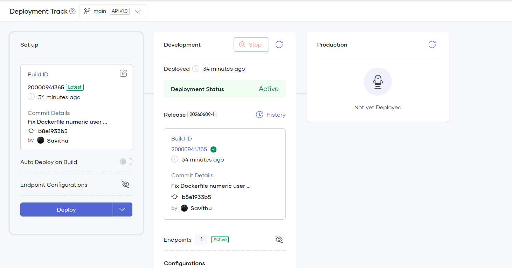
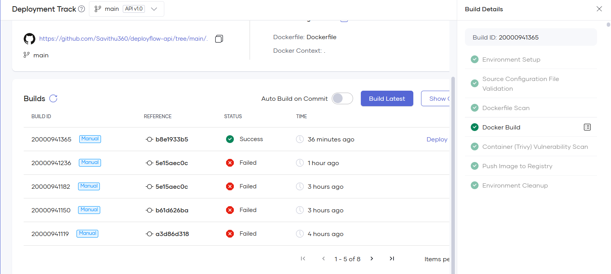
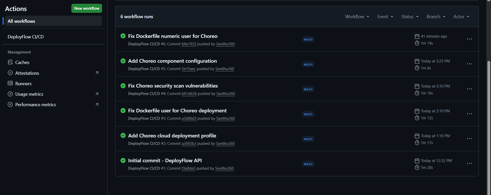
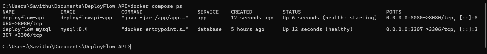
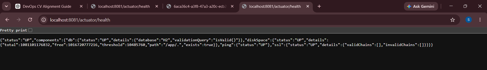
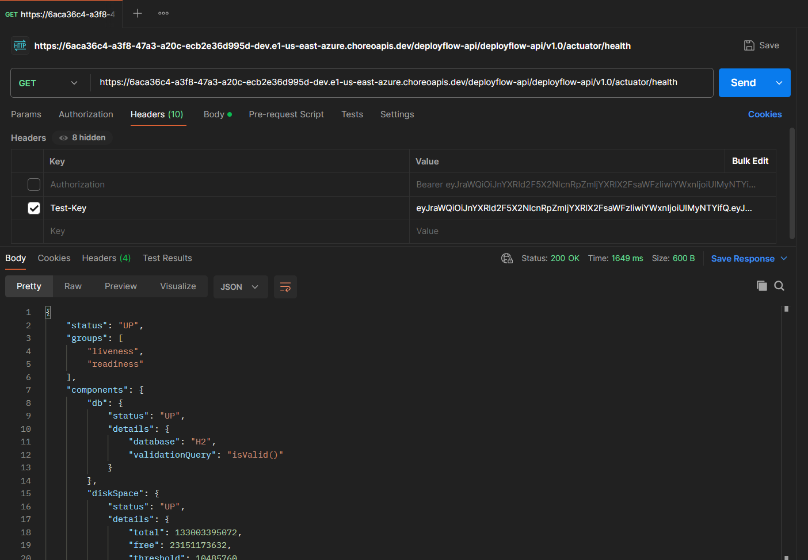
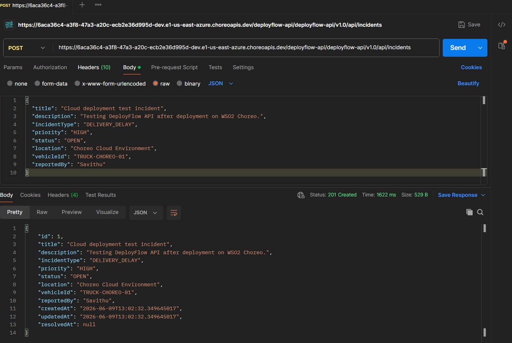
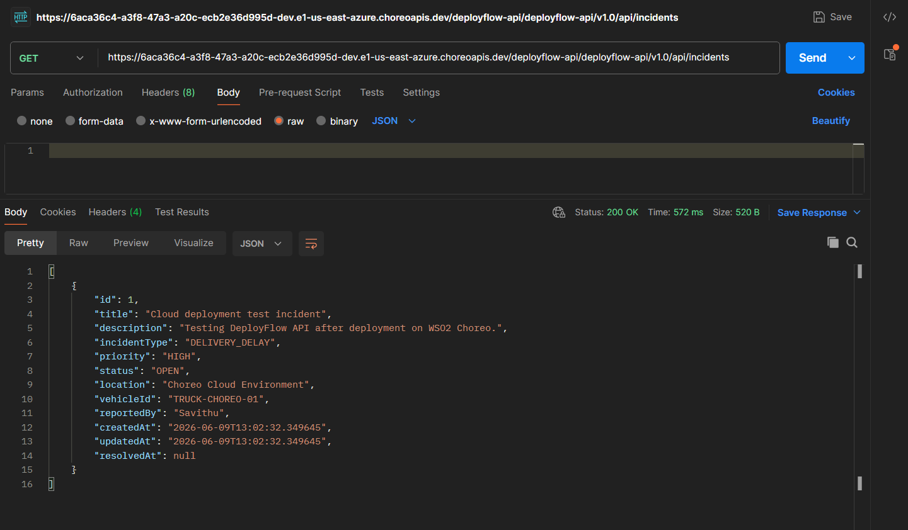
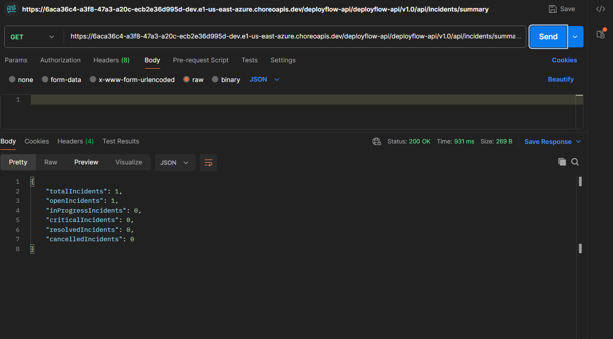

# DeployFlow API

**A DevOps-ready delivery incident tracking API for foodservice operations.**

DeployFlow API is a Spring Boot REST API for tracking delivery and warehouse operation incidents. It was built as a DevOps-focused portfolio project to demonstrate backend development, containerization, CI/CD, cloud deployment, monitoring, infrastructure preparation, automation, and troubleshooting documentation.

---

## Real-World Problem

Foodservice and delivery operations depend on reliable warehouse handling, vehicle availability, route execution, temperature control, and customer order accuracy.

When incidents such as delivery delays, vehicle issues, temperature alerts, warehouse loading problems, missing items, or customer complaints occur, operations teams need a simple way to record, prioritize, monitor, and resolve those issues.

DeployFlow API provides a backend incident tracking system for delivery and warehouse operations.

---

## Project Status

| Area                                   | Status    |
| -------------------------------------- | --------- |
| Spring Boot REST API                   | Completed |
| Local Docker deployment                | Verified  |
| Docker Compose with MySQL              | Verified  |
| GitHub Actions CI/CD                   | Verified  |
| WSO2 Choreo cloud deployment           | Verified  |
| Choreo Test-Key secured API access     | Verified  |
| Spring Boot Actuator health monitoring | Verified  |
| Dockerfile security scan fixes         | Completed |
| AWS EC2 deployment scripts             | Prepared  |
| Terraform EC2 infrastructure template  | Prepared  |

---

## DevOps Concepts Demonstrated

* CI/CD pipeline automation with GitHub Actions
* Multi-stage Docker containerization
* Docker Compose service orchestration
* MySQL database integration for local containerized deployment
* Cloud deployment using WSO2 Choreo
* Environment-based runtime configuration
* Spring Boot Actuator health checks
* Runtime logging
* Dockerfile security improvements
* Non-root container execution
* Container vulnerability scan readiness
* AWS EC2 deployment preparation
* Infrastructure as Code preparation with Terraform
* Bash deployment automation
* Troubleshooting documentation

---

## Tech Stack

| Category                   | Technologies           |
| -------------------------- | ---------------------- |
| Backend                    | Java 21, Spring Boot   |
| API                        | Spring Web, REST API   |
| Database Access            | Spring Data JPA        |
| Validation                 | Spring Validation      |
| Monitoring                 | Spring Boot Actuator   |
| Local Database             | MySQL                  |
| Test / Cloud Demo Database | H2                     |
| Build Tool                 | Maven                  |
| Containerization           | Docker, Docker Compose |
| CI/CD                      | GitHub Actions         |
| Cloud Deployment           | WSO2 Choreo            |
| Infrastructure Preparation | Terraform              |
| Deployment Automation      | Bash                   |
| Future AWS Target          | AWS EC2                |

---

## Architecture Overview

```text
Client / Postman / Choreo Gateway
        |
        v
Controller Layer
        |
        v
Service Layer
        |
        v
Repository Layer
        |
        v
Database
```

The application follows a clean layered architecture:

```text
controller  -> Handles REST API requests
service     -> Handles business logic and logging
repository  -> Handles database access
entity      -> Defines persistence models
dto         -> Defines request and response objects
exception   -> Handles structured API errors
config      -> Contains application configuration where needed
```

Deployment modes are separated clearly:

| Environment            | Runtime                             | Database    |
| ---------------------- | ----------------------------------- | ----------- |
| Local Docker Compose   | Docker + Docker Compose             | MySQL       |
| Automated Tests        | Maven test profile                  | H2          |
| WSO2 Choreo Cloud Demo | Docker service on Choreo            | H2          |
| AWS Preparation        | EC2 scripts and Terraform templates | MySQL-ready |

---

## Folder Structure

```text
.
|-- .choreo/
|   `-- component.yaml
|-- .github/
|   `-- workflows/
|       `-- ci-cd.yml
|-- deployment/
|   |-- deploy.sh
|   `-- ec2-setup.sh
|-- docs/
|   `-- screenshots/
|       |-- actuator-health-choreo.png
|       |-- actuator-health-local-choreo-profile.png
|       |-- choreo-build-success.png
|       |-- choreo-deployment-active.png
|       |-- docker-compose-healthy.png
|       |-- github-actions-success.png
|       |-- postman-create-incident-choreo.png
|       |-- postman-list-incidents-choreo.png
|       `-- postman-summary-choreo.png
|-- infra/
|   `-- terraform/
|       |-- main.tf
|       |-- outputs.tf
|       |-- variables.tf
|       `-- README.md
|-- scripts/
|   `-- log-summary-prompt.md
|-- src/
|   |-- main/
|   |   |-- java/com/savithu/deployflow/
|   |   |   |-- controller/
|   |   |   |-- dto/
|   |   |   |-- entity/
|   |   |   |-- exception/
|   |   |   |-- repository/
|   |   |   `-- service/
|   |   `-- resources/
|   |       |-- application.yml
|   |       `-- application-choreo.yml
|   `-- test/
|       |-- java/com/savithu/deployflow/
|       `-- resources/
|           `-- application.yml
|-- .dockerignore
|-- .env.example
|-- .gitignore
|-- Dockerfile
|-- docker-compose.yml
|-- pom.xml
`-- README.md
```

---

## API Endpoints

| Method | Endpoint                             | Purpose                           |
| ------ | ------------------------------------ | --------------------------------- |
| GET    | `/api/health`                        | Custom application health check   |
| GET    | `/actuator/health`                   | Spring Boot Actuator health check |
| GET    | `/actuator/info`                     | Application information           |
| POST   | `/api/incidents`                     | Create a new incident             |
| GET    | `/api/incidents`                     | List all incidents                |
| GET    | `/api/incidents/{id}`                | Get an incident by ID             |
| PUT    | `/api/incidents/{id}`                | Fully update an incident          |
| DELETE | `/api/incidents/{id}`                | Delete an incident                |
| GET    | `/api/incidents/status/{status}`     | Filter incidents by status        |
| GET    | `/api/incidents/priority/{priority}` | Filter incidents by priority      |
| GET    | `/api/incidents/type/{incidentType}` | Filter incidents by type          |
| PATCH  | `/api/incidents/{id}/resolve`        | Resolve an incident               |
| GET    | `/api/incidents/summary`             | Get operational incident counts   |

---

## Incident Fields

Each incident contains:

```text
id
title
description
incidentType
priority
status
location
vehicleId
reportedBy
createdAt
updatedAt
resolvedAt
```

---

## Incident Types

```text
DELIVERY_DELAY
TEMPERATURE_ALERT
VEHICLE_ISSUE
WAREHOUSE_LOADING_ISSUE
MISSING_ITEMS
CUSTOMER_COMPLAINT
ROUTE_BLOCKED
OTHER
```

---

## Priorities

```text
LOW
MEDIUM
HIGH
CRITICAL
```

---

## Status Values

```text
OPEN
IN_PROGRESS
RESOLVED
CANCELLED
```

---

## Sample Create Incident Request

```json
{
  "title": "Truck delayed due to road closure",
  "description": "Delivery truck was delayed due to an unexpected road closure.",
  "incidentType": "DELIVERY_DELAY",
  "priority": "HIGH",
  "status": "OPEN",
  "location": "Colombo Distribution Route 04",
  "vehicleId": "TRUCK-102",
  "reportedBy": "Operations Team"
}
```

---

## Sample Create Incident Response

```json
{
  "id": 1,
  "title": "Truck delayed due to road closure",
  "description": "Delivery truck was delayed due to an unexpected road closure.",
  "incidentType": "DELIVERY_DELAY",
  "priority": "HIGH",
  "status": "OPEN",
  "location": "Colombo Distribution Route 04",
  "vehicleId": "TRUCK-102",
  "reportedBy": "Operations Team",
  "createdAt": "2026-06-09T12:34:32.236379",
  "updatedAt": "2026-06-09T12:34:32.236379",
  "resolvedAt": null
}
```

---

## Sample Summary Response

```json
{
  "totalIncidents": 2,
  "openIncidents": 1,
  "inProgressIncidents": 0,
  "criticalIncidents": 0,
  "resolvedIncidents": 1,
  "cancelledIncidents": 0
}
```

---

## Error Response Format

Validation and application errors return structured responses.

Example:

```json
{
  "timestamp": "2026-06-09T12:40:10",
  "status": 404,
  "error": "Not Found",
  "message": "Incident not found with id: 99",
  "path": "/api/incidents/99"
}
```

---

## Run Locally Without Docker

Requirements:

```text
Java 21
Maven 3.6.3 or newer
MySQL
```

Set environment variables.

PowerShell:

```powershell
$env:DB_HOST="localhost"
$env:DB_PORT="3306"
$env:DB_NAME="deployflow"
$env:DB_USERNAME="deployflow"
$env:DB_PASSWORD="your-password"

mvn clean test
mvn spring-boot:run
```

The application runs at:

```text
http://localhost:8080
```

---

## Run Locally With Docker Compose

The easiest local setup is Docker Compose because it starts both the Spring Boot API and MySQL.

```bash
docker compose up --build
```

Check running containers:

```bash
docker compose ps
```

View application logs:

```bash
docker compose logs -f app
```

View database logs:

```bash
docker compose logs -f database
```

Stop containers:

```bash
docker compose down
```

Stop containers and remove local MySQL data:

```bash
docker compose down -v
```

Local Docker URLs:

```text
http://localhost:8080/api/health
http://localhost:8080/actuator/health
http://localhost:8080/api/incidents
http://localhost:8080/api/incidents/summary
```

---

## WSO2 Choreo Cloud Deployment

DeployFlow API is deployed on **WSO2 Choreo** as a Docker-based cloud service.

The Choreo deployment uses the `choreo` Spring profile:

```text
SPRING_PROFILES_ACTIVE=choreo
```

The `choreo` profile uses an in-memory H2 database. This keeps the cloud demo simple and avoids provisioning an external database for the portfolio demonstration.

### Choreo Base URL

Development invoke URL:

```text
https://6aca36c4-a3f8-47a3-a20c-ecb2e36d995d-dev.e1-us-east-azure.choreoapis.dev/deployflow-api/deployflow-api/v1.0
```

### Choreo Authentication

Choreo protects the development endpoint using a generated `Test-Key`.

For Postman testing, add this header:

```text
Test-Key: <CHOREO_GENERATED_TEST_KEY>
```

Do not commit or share the real Test-Key.

### Verified Choreo Endpoints

Use the Choreo base URL plus the following paths:

```text
GET /actuator/health
GET /api/health
GET /api/incidents
GET /api/incidents/summary
POST /api/incidents
PATCH /api/incidents/{id}/resolve
```

Example:

```text
GET https://6aca36c4-a3f8-47a3-a20c-ecb2e36d995d-dev.e1-us-east-azure.choreoapis.dev/deployflow-api/deployflow-api/v1.0/actuator/health
```

---

## Docker Security Improvements for Choreo

The Dockerfile was updated to satisfy Choreo security requirements.

Key improvements:

* Uses a minimal Java runtime image
* Runs as a numeric non-root user
* Uses `USER 10001`
* Avoids unnecessary OS packages
* Passes Choreo Dockerfile scan
* Passes container vulnerability scanning with no high or critical vulnerabilities

This is important because Choreo requires the container user to be a numeric user ID between `10000` and `20000`.

---

## GitHub Actions CI/CD

The GitHub Actions workflow runs on pushes and pull requests to `main`.

The pipeline:

```text
1. Checks out source code
2. Sets up Java
3. Caches Maven dependencies
4. Runs tests
5. Packages the Spring Boot application
6. Builds the Docker image
```

Workflow file:

```text
.github/workflows/ci-cd.yml
```

Optional EC2 deployment steps are documented but kept disabled until real AWS deployment is configured.

---

## AWS EC2 Deployment Preparation

AWS EC2 deployment scripts are included for future AWS deployment.

Files:

```text
deployment/ec2-setup.sh
deployment/deploy.sh
```

The EC2 setup script prepares an Ubuntu server with Docker and Docker Compose.

The deployment script is designed to:

```text
pull latest code
stop old containers
rebuild containers
start containers
show logs
```

Expected future AWS health URL:

```text
http://EC2_PUBLIC_IP:8080/actuator/health
```

AWS deployment is prepared, but the currently verified cloud deployment is on WSO2 Choreo.

---

## Terraform Infrastructure Template

Terraform files are included in:

```text
infra/terraform/
```

The template includes:

```text
AWS provider placeholder
EC2 instance resource
Security group resource
SSH port 22
Application port 8080
HTTP port 80
Variables
Outputs
```

Before using Terraform, configure AWS credentials outside the repository and update variables safely.

---

## Monitoring and Health Checks

Local health checks:

```bash
curl http://localhost:8080/api/health
curl http://localhost:8080/actuator/health
curl http://localhost:8080/actuator/info
```

Docker logs:

```bash
docker compose logs --tail=100 app
docker compose logs --tail=100 database
```

Choreo health check:

```text
GET /actuator/health
Header: Test-Key: <CHOREO_GENERATED_TEST_KEY>
```

---

## Troubleshooting

| Problem                       | Cause                            | Fix                                                              |
| ----------------------------- | -------------------------------- | ---------------------------------------------------------------- |
| MySQL connection refused      | Database not ready or wrong host | Use `database` as DB host inside Docker Compose                  |
| Port 8080 already in use      | Another app is using the port    | Stop the process or change host port                             |
| Port 3306 already in use      | Local MySQL is already running   | Map MySQL to host port `3307`                                    |
| Docker build failed           | Dependency or image issue        | Run `docker build -t deployflow-api:local .` and inspect logs    |
| Maven not recognized          | Maven not installed locally      | Use Maven through Docker or install Maven                        |
| GitHub Actions failed         | Test/build error                 | Open Actions logs and fix first failing step                     |
| Choreo Dockerfile scan failed | Non-compliant container user     | Use numeric non-root user such as `USER 10001`                   |
| Choreo Trivy scan failed      | Vulnerable OS/package layer      | Use minimal image and remove unnecessary packages                |
| Choreo returns 401            | Missing or expired Test-Key      | Generate a new Choreo Test-Key and add it as `Test-Key` header   |
| Choreo returns 404            | Wrong endpoint path              | Add `/actuator/health`, `/api/health`, or another valid API path |
| Actuator endpoint unavailable | Endpoint not exposed             | Check actuator exposure config in `application.yml`              |
| Invalid enum value            | Wrong status/type/priority value | Use uppercase enum values exactly as documented                  |

---

## Screenshots

Project verification screenshots are stored in:

```text
docs/screenshots/
```

### Choreo Deployment Active



### Choreo Build Success



### GitHub Actions Success



### Docker Compose Healthy



### Local Choreo Profile Health Check



### Choreo Actuator Health



### Create Incident on Choreo



### List Incidents on Choreo



### Incident Summary on Choreo



> Note: Choreo Test-Key values are hidden before screenshots are committed.

---

## Future Improvements

* Deploy to AWS EC2 using the included scripts
* Add AWS RDS for managed MySQL
* Add HTTPS with a custom domain
* Add authentication and role-based authorization
* Add pagination and sorting
* Add OpenAPI/Swagger documentation
* Add Flyway database migrations
* Add Testcontainers for production-like integration testing
* Add centralized logging and metrics dashboards
* Add automated rollback strategy
* Publish Docker image to a container registry

---

## Job Role Alignment

| DevOps Intern Requirement | How DeployFlow API Demonstrates It                                              |
| ------------------------- | ------------------------------------------------------------------------------- |
| CI/CD pipelines           | GitHub Actions workflow runs tests, packages the app, and builds a Docker image |
| Cloud deployment          | Deployed on WSO2 Choreo as a cloud-hosted service                               |
| AWS cloud readiness       | EC2 setup scripts and Terraform templates included                              |
| Infrastructure as Code    | Terraform template prepared for AWS EC2                                         |
| Containerization          | Multi-stage Dockerfile and Docker Compose setup                                 |
| Monitoring                | Spring Boot Actuator health and info endpoints                                  |
| Troubleshooting           | README includes common issues and fixes                                         |
| Automation                | Bash scripts and GitHub Actions workflow                                        |
| Documentation             | Setup, deployment, API, and troubleshooting documentation included              |
| AI-driven automation      | Log analysis prompt included in `scripts/log-summary-prompt.md`                 |

---

## Portfolio Summary

**DeployFlow API – Delivery Incident Tracking System**

Built a DevOps-ready Spring Boot REST API for tracking delivery and warehouse operation incidents. The project includes Docker containerization, Docker Compose with MySQL, GitHub Actions CI/CD, WSO2 Choreo cloud deployment, Actuator health monitoring, Choreo Test-Key secured API access, AWS EC2 deployment scripts, Terraform infrastructure templates, and troubleshooting documentation.

---

## Repository Topics

```text
java
spring-boot
rest-api
mysql
h2
docker
docker-compose
github-actions
wso2-choreo
aws
ec2
terraform
devops
monitoring
ci-cd
portfolio-project
```

---

## Author

**Savithu Pemachandra**

GitHub: [Savithu360](https://github.com/Savithu360)
